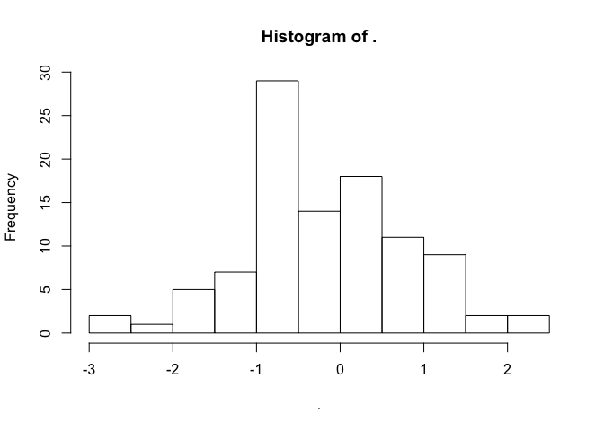
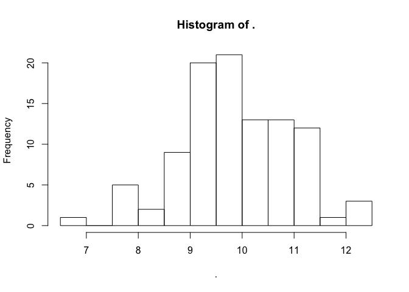
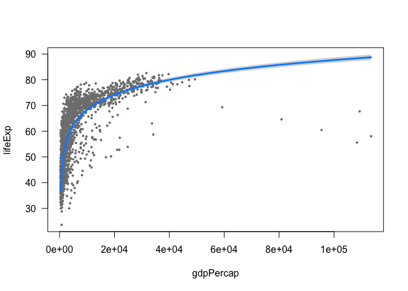
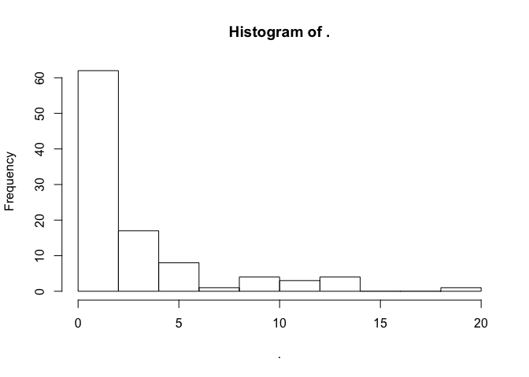
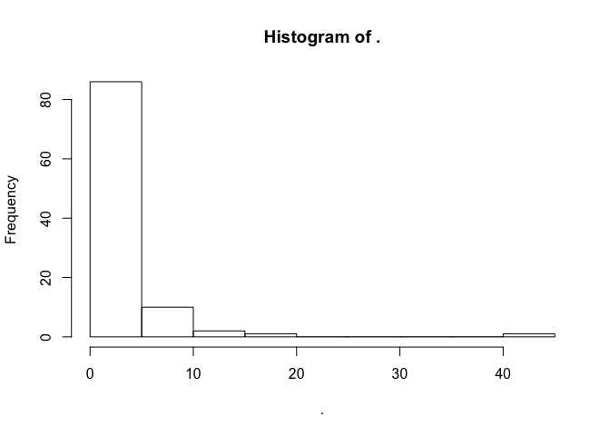
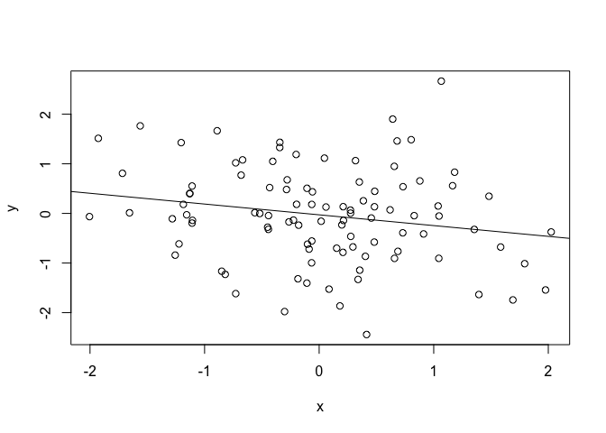
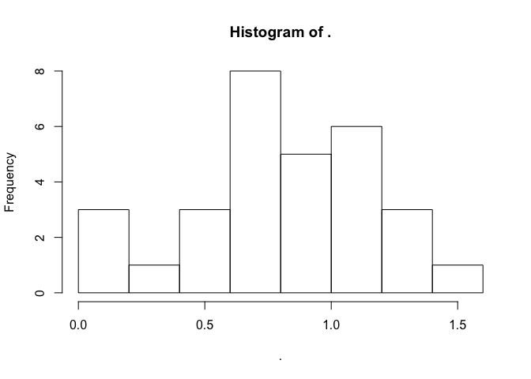
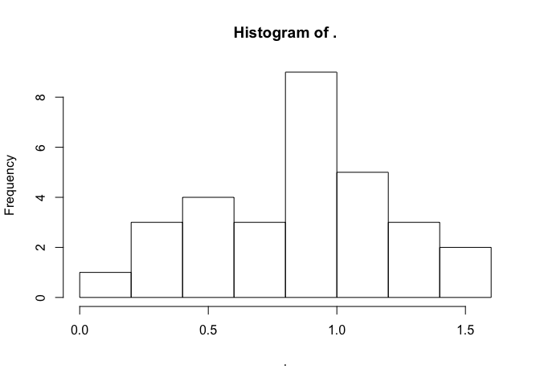
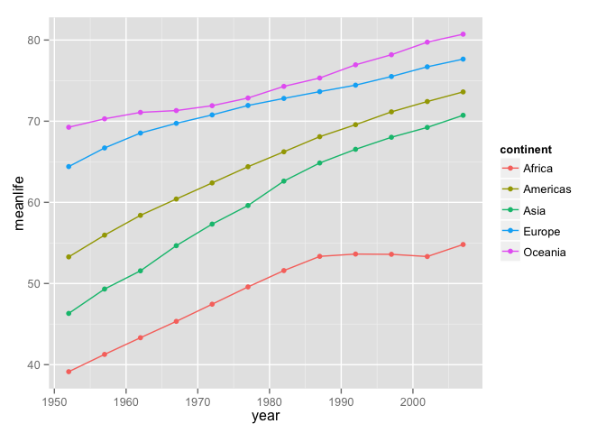

# magrittr/dplyr demo
Andrew and Kieran  
May 5, 2015  


### Part 1: magrittr basics
install.packages("magrittr")
install.packages("gapminder")
install.packages("dplyr")
install.packages("ggplot2")
install.packages("visreg")


```r
# load libraries
library("magrittr")
library("gapminder")
library("dplyr")
```

```
## 
## Attaching package: 'dplyr'
## 
## The following object is masked from 'package:stats':
## 
##     filter
## 
## The following objects are masked from 'package:base':
## 
##     intersect, setdiff, setequal, union
```

```r
library("visreg")

# recall function rnorm
rnorm(n = 100, mean = 0)
```

```
##   [1]  1.58258022  0.36716763 -0.95230952  0.04765988  2.26978410
##   [6] -1.12796806 -0.17386246  0.73746330 -0.88107375  1.04191687
##  [11]  0.18064476  0.20631550  0.65347745  0.29613380  0.50261653
##  [16]  2.38337177 -0.78507186  1.52376324  0.83046763 -0.62546492
##  [21] -0.87128811  1.11036525 -2.22497234  0.28890335  0.19263184
##  [26]  0.45646911 -0.22593814  0.74485438 -0.33538882 -0.38319435
##  [31]  0.97256197  0.60275942 -1.90652201  1.82028698 -0.26004302
##  [36]  0.33815049  0.66448101 -0.74152463 -0.55147118  0.79226824
##  [41]  2.23168673 -1.64521571  1.25904647 -0.28256179  0.48999427
##  [46] -1.08589488 -0.45462116  0.78455876 -0.39911200 -0.13170846
##  [51] -1.32009158 -0.97348604  0.87067614  0.66784415 -1.79087787
##  [56]  1.70334021 -0.28053034 -0.49387995  2.18225778 -0.10092747
##  [61]  0.59037646 -0.89908894  1.51915742 -0.54508909 -1.86606837
##  [66]  1.50550809  0.89505634  1.15906566  0.63165662  0.62638301
##  [71]  1.03814244 -0.03527482 -0.05692871 -1.15380416  0.09445854
##  [76]  0.34706325  2.07464497 -1.42920066 -0.87649213  1.49114138
##  [81] -2.63008557  0.36391217 -0.39395187 -1.24563290  0.09385472
##  [86] -0.12799506  0.06982178  0.29721227  1.72150508 -1.25744970
##  [91]  1.70016876 -0.88506248 -1.20459835  1.02411596  0.51409984
##  [96] -1.39034987 -1.49228474 -0.90978110 -0.28944577 -0.23368586
```

```r
# basic pipe usage
# output of pipe is (by default) passed to *first* argument of target function
rnorm(100) %>% mean
```

```
## [1] 0.05620525
```

```r
rnorm(100) %>% hist
```

 

```r
#this includes when arguments other than the first are explicitly defined, e.g.
100 %>% rnorm(mean = 10) %>% hist
```

 

```r
# can pipe to as many functions as you like
100 %>% rnorm %>% mean
```

```
## [1] 0.09646043
```

```r
100 %>% rnorm %>% abs %>% sqrt %>% mean
```

```
## [1] 0.7483698
```

```r
#compare to parenthesis mess below
mean(sqrt(abs(rnorm(100))))
```

```
## [1] 0.8280577
```

```r
#another example
letters %>% toupper %>% rev %>% paste0 (collapse = "") 
```

```
## [1] "ZYXWVUTSRQPONMLKJIHGFEDCBA"
```

```r
# what if we want to pipe in places other than the first argument?
# use "."
10 %>% rnorm(n = 100, mean = .) %>% mean
```

```
## [1] 9.971149
```

```r
# pipe a dataframe to subset 
gapminder %>% subset(country == "Zambia") 
```

```
##      country continent year lifeExp      pop gdpPercap
## 1681  Zambia    Africa 1952  42.038  2672000  1147.389
## 1682  Zambia    Africa 1957  44.077  3016000  1311.957
## 1683  Zambia    Africa 1962  46.023  3421000  1452.726
## 1684  Zambia    Africa 1967  47.768  3900000  1777.077
## 1685  Zambia    Africa 1972  50.107  4506497  1773.498
## 1686  Zambia    Africa 1977  51.386  5216550  1588.688
## 1687  Zambia    Africa 1982  51.821  6100407  1408.679
## 1688  Zambia    Africa 1987  50.821  7272406  1213.315
## 1689  Zambia    Africa 1992  46.100  8381163  1210.885
## 1690  Zambia    Africa 1997  40.238  9417789  1071.354
## 1691  Zambia    Africa 2002  39.193 10595811  1071.614
## 1692  Zambia    Africa 2007  42.384 11746035  1271.212
```

```r
# what will this do?
gapminder %>% lapply(class)
```

```
## $country
## [1] "factor"
## 
## $continent
## [1] "factor"
## 
## $year
## [1] "numeric"
## 
## $lifeExp
## [1] "numeric"
## 
## $pop
## [1] "numeric"
## 
## $gdpPercap
## [1] "numeric"
```

```r
# pipin hot linear models
gapminder %>% lm(lifeExp ~ gdpPercap, data = .)
```

```
## 
## Call:
## lm(formula = lifeExp ~ gdpPercap, data = .)
## 
## Coefficients:
## (Intercept)    gdpPercap  
##   5.396e+01    7.649e-04
```

```r
gapminder %>% lm(lifeExp ~ gdpPercap, data = .) %>% summary
```

```
## 
## Call:
## lm(formula = lifeExp ~ gdpPercap, data = .)
## 
## Residuals:
##     Min      1Q  Median      3Q     Max 
## -82.754  -7.758   2.176   8.225  18.426 
## 
## Coefficients:
##              Estimate Std. Error t value Pr(>|t|)    
## (Intercept) 5.396e+01  3.150e-01  171.29   <2e-16 ***
## gdpPercap   7.649e-04  2.579e-05   29.66   <2e-16 ***
## ---
## Signif. codes:  0 '***' 0.001 '**' 0.01 '*' 0.05 '.' 0.1 ' ' 1
## 
## Residual standard error: 10.49 on 1702 degrees of freedom
## Multiple R-squared:  0.3407,	Adjusted R-squared:  0.3403 
## F-statistic: 879.6 on 1 and 1702 DF,  p-value: < 2.2e-16
```

```r
gapminder %>% lm(lifeExp ~ gdpPercap, data = .) %>% anova
```

```
## Analysis of Variance Table
## 
## Response: lifeExp
##             Df Sum Sq Mean Sq F value    Pr(>F)    
## gdpPercap    1  96813   96813  879.58 < 2.2e-16 ***
## Residuals 1702 187335     110                      
## ---
## Signif. codes:  0 '***' 0.001 '**' 0.01 '*' 0.05 '.' 0.1 ' ' 1
```

```r
gapminder %>% lm(lifeExp ~ gdpPercap + continent + country + pop, data=.) %>% drop1
```

```
## Single term deletions
## 
## Model:
## lifeExp ~ gdpPercap + continent + country + pop
##            Df Sum of Sq    RSS    AIC
## <none>                   59768 6350.0
## gdpPercap   1      6713  66481 6529.4
## continent   0         0  59768 6350.0
## country   137     58987 118754 7245.9
## pop         1      6285  66053 6518.3
```

```r
# we can also assign the output of a pipe like so:
gm.mod <- gapminder %>% lm(lifeExp ~ log(gdpPercap), data = .)
visreg(gm.mod)
```

 

### Part 2: magrittr extended


```r
# define "functional sequences""
funct <- . %>% abs %>% sqrt %>% hist
rnorm(100) %>% funct
```

 

```r
# same as
f <- function(x){
  hist(sqrt(abs(x)))
}

# what if we need to make each "step" a bit more complex? 
# could define a function outside, but can also do it "in line"
# i.e. lambda expressions

 rnorm(100) %>% 
  abs() %>% {
  x <- sqrt(.)
  y <- exp(.)
  x * y
  } %>%
  hist
```

 

```r
# pass arbitrary numbers of args 
list(x = rnorm(100), y = runif(100)) %>% with(cor(x, y))
```

```
## [1] -0.1516197
```

```r
# short form is the %$% ("exposition"") operator
list(x = rnorm(100), y = runif(100)) %$% cor(x, y)
```

```
## [1] -0.003579102
```

```r
# what if we want to pipe through a function with no return value (e.g. a plot?), but continue the pipe?
# can use the "tee" operator %T>%
# creates a "branch" in the pipe

rnorm(100) %>%
  abs %T>%
  hist %>%
  log
```

 

```
##   [1] -2.523833304 -0.014515775  0.505113445 -0.656937528 -0.221022341
##   [6] -0.626861935 -0.650659069 -1.286504999 -0.833459481  0.396694396
##  [11]  0.382712937 -0.925918548 -0.151003893 -0.405027323 -0.359674790
##  [16] -0.524540795 -1.421594720 -1.378200272 -1.314646329 -0.041553077
##  [21] -0.020977217 -2.973839393 -1.969536760 -0.013356439 -4.544775489
##  [26] -0.212205051 -0.659381443 -3.218062318 -1.863291830 -1.239744809
##  [31] -0.133366584  0.696122325  0.605691153 -1.310068355 -0.378314185
##  [36] -0.332399933  0.039429985 -2.314916616  0.171445991  0.667143276
##  [41]  0.722062969  0.059452529  0.071556422 -0.075409952  0.619359064
##  [46] -1.652689457  0.458924837  0.517053996 -2.845290330  0.039649956
##  [51] -0.576681007 -0.284742650 -0.118910293 -0.364981295  0.148440225
##  [56] -0.629669971 -1.317716139 -0.198436493 -0.003083958 -1.647022965
##  [61] -0.434718812 -1.041135635  1.194511050 -0.621710847 -0.735804413
##  [66] -0.352451913 -0.620705646 -0.929163755 -1.609989507 -1.171533265
##  [71] -0.528038589 -1.052951413  0.023222322 -0.310829890 -2.798786563
##  [76] -2.145808359  0.272638613 -2.669913629 -2.438118397  0.285094948
##  [81] -0.753676709 -1.064121066 -0.442156844 -2.441481860  0.099875149
##  [86] -1.693542335 -0.305785031 -1.160043784 -0.332214266 -0.299752631
##  [91] -1.240870856  0.161478712 -0.326810049  0.189786698 -0.146328616
##  [96] -0.489662044 -0.830339324  0.795892563 -0.297414147 -0.795483297
```

```r
list(x = rnorm(100), y = rnorm(100)) %T>% 
  with(plot(x, y)) %>%
  with(lm(y ~ x)) %T>% 
  abline %>% 
  summary
```

 

```
## 
## Call:
## lm(formula = y ~ x)
## 
## Residuals:
##      Min       1Q   Median       3Q      Max 
## -2.34959 -0.57054  0.03601  0.59669  2.13902 
## 
## Coefficients:
##             Estimate Std. Error t value Pr(>|t|)
## (Intercept) -0.09860    0.09520  -1.036    0.303
## x            0.03768    0.09734   0.387    0.700
## 
## Residual standard error: 0.9476 on 98 degrees of freedom
## Multiple R-squared:  0.001527,	Adjusted R-squared:  -0.008662 
## F-statistic: 0.1499 on 1 and 98 DF,  p-value: 0.6995
```

```r
plot.model <- . %T>% 
  with(plot(x, y)) %>%
  with(lm(y ~ x)) %T>% 
  abline %>% 
  summary

list(x = rnorm(100), y = rnorm(100)) %>% plot.model
```

 

```
## 
## Call:
## lm(formula = y ~ x)
## 
## Residuals:
##     Min      1Q  Median      3Q     Max 
## -2.6775 -0.4875  0.0382  0.5661  2.2303 
## 
## Coefficients:
##              Estimate Std. Error t value Pr(>|t|)
## (Intercept)  0.008156   0.091115   0.090    0.929
## x           -0.012630   0.091496  -0.138    0.890
## 
## Residual standard error: 0.9091 on 98 degrees of freedom
## Multiple R-squared:  0.0001944,	Adjusted R-squared:  -0.01001 
## F-statistic: 0.01906 on 1 and 98 DF,  p-value: 0.8905
```

### Part 3: dplyr basics


```r
# create a data frame tbl (not usually necessary)
gm <- gapminder %>% tbl_df 

# tbl_dfs can be easily converted back to datafames
gm %>% data.frame() %>% head()
```

```
##       country continent year lifeExp      pop gdpPercap
## 1 Afghanistan      Asia 1952  28.801  8425333  779.4453
## 2 Afghanistan      Asia 1957  30.332  9240934  820.8530
## 3 Afghanistan      Asia 1962  31.997 10267083  853.1007
## 4 Afghanistan      Asia 1967  34.020 11537966  836.1971
## 5 Afghanistan      Asia 1972  36.088 13079460  739.9811
## 6 Afghanistan      Asia 1977  38.438 14880372  786.1134
```

```r
# arrage dataframe by a variable
gm %>% arrange(year)
```

```
## Source: local data frame [1,704 x 6]
## 
##        country continent year lifeExp      pop  gdpPercap
## 1  Afghanistan      Asia 1952  28.801  8425333   779.4453
## 2      Albania    Europe 1952  55.230  1282697  1601.0561
## 3      Algeria    Africa 1952  43.077  9279525  2449.0082
## 4       Angola    Africa 1952  30.015  4232095  3520.6103
## 5    Argentina  Americas 1952  62.485 17876956  5911.3151
## 6    Australia   Oceania 1952  69.120  8691212 10039.5956
## 7      Austria    Europe 1952  66.800  6927772  6137.0765
## 8      Bahrain      Asia 1952  50.939   120447  9867.0848
## 9   Bangladesh      Asia 1952  37.484 46886859   684.2442
## 10     Belgium    Europe 1952  68.000  8730405  8343.1051
## ..         ...       ...  ...     ...      ...        ...
```

```r
# select columns of a dataframe
gm %>% select(year, country, continent)
```

```
## Source: local data frame [1,704 x 3]
## 
##    year     country continent
## 1  1952 Afghanistan      Asia
## 2  1957 Afghanistan      Asia
## 3  1962 Afghanistan      Asia
## 4  1967 Afghanistan      Asia
## 5  1972 Afghanistan      Asia
## 6  1977 Afghanistan      Asia
## 7  1982 Afghanistan      Asia
## 8  1987 Afghanistan      Asia
## 9  1992 Afghanistan      Asia
## 10 1997 Afghanistan      Asia
## ..  ...         ...       ...
```

```r
# create a new column 
gm %>% mutate(pop.thou = pop/1000)
```

```
## Source: local data frame [1,704 x 7]
## 
##        country continent year lifeExp      pop gdpPercap  pop.thou
## 1  Afghanistan      Asia 1952  28.801  8425333  779.4453  8425.333
## 2  Afghanistan      Asia 1957  30.332  9240934  820.8530  9240.934
## 3  Afghanistan      Asia 1962  31.997 10267083  853.1007 10267.083
## 4  Afghanistan      Asia 1967  34.020 11537966  836.1971 11537.966
## 5  Afghanistan      Asia 1972  36.088 13079460  739.9811 13079.460
## 6  Afghanistan      Asia 1977  38.438 14880372  786.1134 14880.372
## 7  Afghanistan      Asia 1982  39.854 12881816  978.0114 12881.816
## 8  Afghanistan      Asia 1987  40.822 13867957  852.3959 13867.957
## 9  Afghanistan      Asia 1992  41.674 16317921  649.3414 16317.921
## 10 Afghanistan      Asia 1997  41.763 22227415  635.3414 22227.415
## ..         ...       ...  ...     ...      ...       ...       ...
```

```r
gm %>% mutate(pop.thou = pop/1000, pop.mil = pop/1000000)
```

```
## Source: local data frame [1,704 x 8]
## 
##        country continent year lifeExp      pop gdpPercap  pop.thou
## 1  Afghanistan      Asia 1952  28.801  8425333  779.4453  8425.333
## 2  Afghanistan      Asia 1957  30.332  9240934  820.8530  9240.934
## 3  Afghanistan      Asia 1962  31.997 10267083  853.1007 10267.083
## 4  Afghanistan      Asia 1967  34.020 11537966  836.1971 11537.966
## 5  Afghanistan      Asia 1972  36.088 13079460  739.9811 13079.460
## 6  Afghanistan      Asia 1977  38.438 14880372  786.1134 14880.372
## 7  Afghanistan      Asia 1982  39.854 12881816  978.0114 12881.816
## 8  Afghanistan      Asia 1987  40.822 13867957  852.3959 13867.957
## 9  Afghanistan      Asia 1992  41.674 16317921  649.3414 16317.921
## 10 Afghanistan      Asia 1997  41.763 22227415  635.3414 22227.415
## ..         ...       ...  ...     ...      ...       ...       ...
## Variables not shown: pop.mil (dbl)
```

```r
# filter rows by some criteria
gm %>% filter(country == "Zambia")
```

```
## Source: local data frame [12 x 6]
## 
##    country continent year lifeExp      pop gdpPercap
## 1   Zambia    Africa 1952  42.038  2672000  1147.389
## 2   Zambia    Africa 1957  44.077  3016000  1311.957
## 3   Zambia    Africa 1962  46.023  3421000  1452.726
## 4   Zambia    Africa 1967  47.768  3900000  1777.077
## 5   Zambia    Africa 1972  50.107  4506497  1773.498
## 6   Zambia    Africa 1977  51.386  5216550  1588.688
## 7   Zambia    Africa 1982  51.821  6100407  1408.679
## 8   Zambia    Africa 1987  50.821  7272406  1213.315
## 9   Zambia    Africa 1992  46.100  8381163  1210.885
## 10  Zambia    Africa 1997  40.238  9417789  1071.354
## 11  Zambia    Africa 2002  39.193 10595811  1071.614
## 12  Zambia    Africa 2007  42.384 11746035  1271.212
```

```r
gm %>% filter(country == "Zambia", year < 1977)
```

```
## Source: local data frame [5 x 6]
## 
##   country continent year lifeExp     pop gdpPercap
## 1  Zambia    Africa 1952  42.038 2672000  1147.389
## 2  Zambia    Africa 1957  44.077 3016000  1311.957
## 3  Zambia    Africa 1962  46.023 3421000  1452.726
## 4  Zambia    Africa 1967  47.768 3900000  1777.077
## 5  Zambia    Africa 1972  50.107 4506497  1773.498
```

```r
# create a grouped tbl_df ("grouped_df")
gm %>% 
  group_by(country)
```

```
## Source: local data frame [1,704 x 6]
## Groups: country
## 
##        country continent year lifeExp      pop gdpPercap
## 1  Afghanistan      Asia 1952  28.801  8425333  779.4453
## 2  Afghanistan      Asia 1957  30.332  9240934  820.8530
## 3  Afghanistan      Asia 1962  31.997 10267083  853.1007
## 4  Afghanistan      Asia 1967  34.020 11537966  836.1971
## 5  Afghanistan      Asia 1972  36.088 13079460  739.9811
## 6  Afghanistan      Asia 1977  38.438 14880372  786.1134
## 7  Afghanistan      Asia 1982  39.854 12881816  978.0114
## 8  Afghanistan      Asia 1987  40.822 13867957  852.3959
## 9  Afghanistan      Asia 1992  41.674 16317921  649.3414
## 10 Afghanistan      Asia 1997  41.763 22227415  635.3414
## ..         ...       ...  ...     ...      ...       ...
```

```r
# apply a function to the groups (e.g. summarise)
gm %>% 
  group_by(country) %>%
  summarize(mean_life = mean(lifeExp))
```

```
## Source: local data frame [142 x 2]
## 
##        country mean_life
## 1  Afghanistan  37.47883
## 2      Albania  68.43292
## 3      Algeria  59.03017
## 4       Angola  37.88350
## 5    Argentina  69.06042
## 6    Australia  74.66292
## 7      Austria  73.10325
## 8      Bahrain  65.60567
## 9   Bangladesh  49.83408
## 10     Belgium  73.64175
## ..         ...       ...
```

```r
# multiple groups can be specified
gm %>% 
  group_by(continent, country) 
```

```
## Source: local data frame [1,704 x 6]
## Groups: continent, country
## 
##        country continent year lifeExp      pop gdpPercap
## 1  Afghanistan      Asia 1952  28.801  8425333  779.4453
## 2  Afghanistan      Asia 1957  30.332  9240934  820.8530
## 3  Afghanistan      Asia 1962  31.997 10267083  853.1007
## 4  Afghanistan      Asia 1967  34.020 11537966  836.1971
## 5  Afghanistan      Asia 1972  36.088 13079460  739.9811
## 6  Afghanistan      Asia 1977  38.438 14880372  786.1134
## 7  Afghanistan      Asia 1982  39.854 12881816  978.0114
## 8  Afghanistan      Asia 1987  40.822 13867957  852.3959
## 9  Afghanistan      Asia 1992  41.674 16317921  649.3414
## 10 Afghanistan      Asia 1997  41.763 22227415  635.3414
## ..         ...       ...  ...     ...      ...       ...
```

```r
# functions are applied from last to first specified
gm %>% 
  group_by(continent, country) %>%
  summarize(mean_life = mean(lifeExp)) 
```

```
## Source: local data frame [142 x 3]
## Groups: continent
## 
##    continent                  country mean_life
## 1     Africa                  Algeria  59.03017
## 2     Africa                   Angola  37.88350
## 3     Africa                    Benin  48.77992
## 4     Africa                 Botswana  54.59750
## 5     Africa             Burkina Faso  44.69400
## 6     Africa                  Burundi  44.81733
## 7     Africa                 Cameroon  48.12850
## 8     Africa Central African Republic  43.86692
## 9     Africa                     Chad  46.77358
## 10    Africa                  Comoros  52.38175
## ..       ...                      ...       ...
```

```r
# after the last function is applied, a tbl_df (no groups) is returned
gm %>% 
  group_by(continent, country) %>%
  summarize(mean_life = mean(lifeExp)) %>%
  summarize(mean_contient_life = mean(mean_life))
```

```
## Source: local data frame [5 x 2]
## 
##   continent mean_contient_life
## 1    Africa           48.86533
## 2  Americas           64.65874
## 3      Asia           60.06490
## 4    Europe           71.90369
## 5   Oceania           74.32621
```

```r
# tally: count observations in groups
gm %>% 
  group_by(continent, country) %>%
  tally %>%
  tally
```

```
## Using n as weighting variable
```

```
## Source: local data frame [5 x 2]
## 
##   continent   n
## 1    Africa 624
## 2  Americas 300
## 3      Asia 396
## 4    Europe 360
## 5   Oceania  24
```

```r
# example of a complete chain
library(ggplot2)

gm %>% 
  group_by(continent, year) %>%
  summarize(meanlife = mean(lifeExp)) %>%
  ggplot(aes(x = year, y = meanlife, colour = continent)) + 
    geom_point() + 
    geom_line()
```

 

### Part 4: dplyr extended


```r
# insert join stuff here

# identify outliers of some kind?
```


