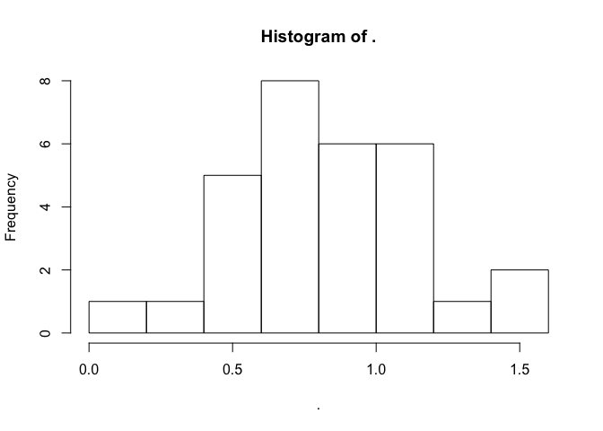
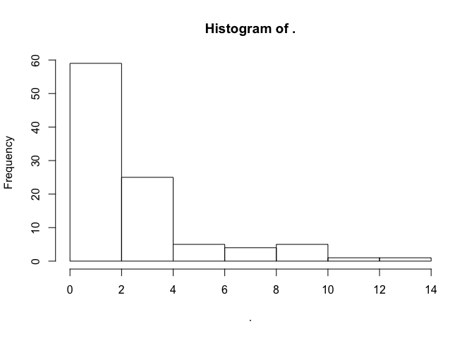
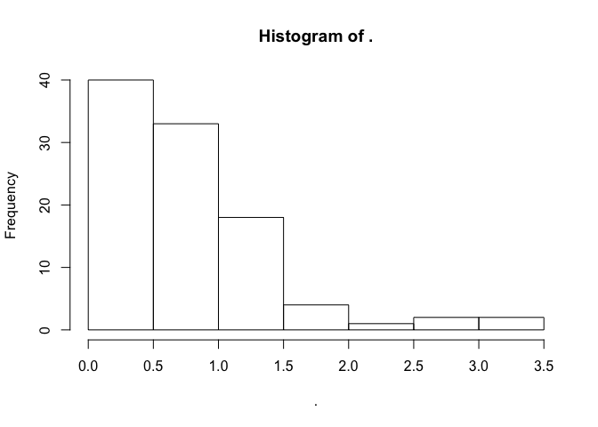
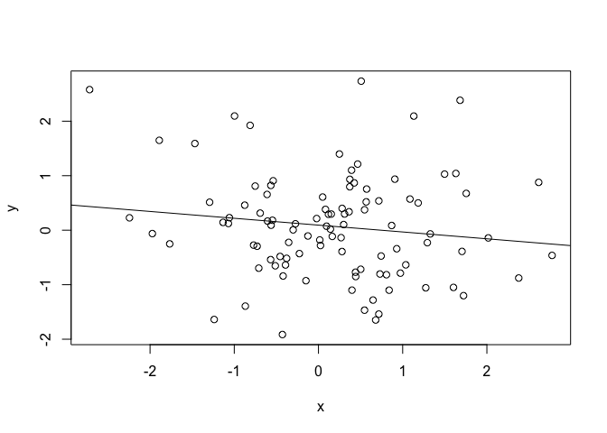
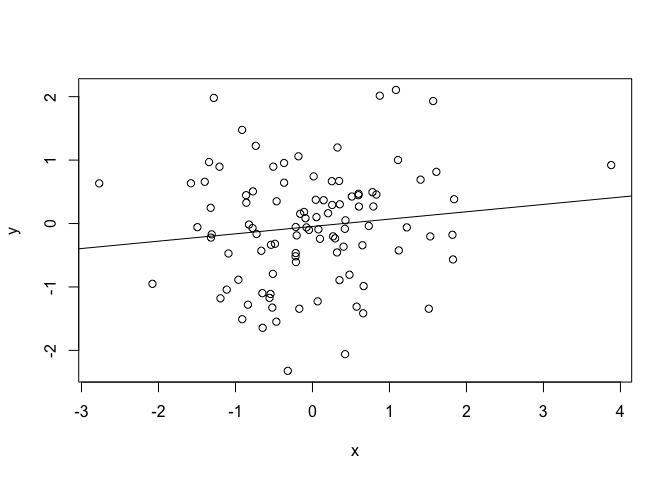

# magrittr/dplyr demo
Andrew and Kieran  
May 5, 2015  


### Part 1: magrittr basics
install.packages("magrittr")
install.packages("gapminder")
install.packages("dplyr")
install.packages("ggplot2")
install.packages("visreg")


```r
#### KIERAN

# load libraries
library("magrittr")
library("gapminder")
library("dplyr")
```

```
## 
## Attaching package: 'dplyr'
## 
## The following object is masked from 'package:stats':
## 
##     filter
## 
## The following objects are masked from 'package:base':
## 
##     intersect, setdiff, setequal, union
```

```r
library("ggplot2")
library("visreg")

# recall function rnorm
rnorm(n = 100, mean = 0)
```

```
##   [1] -0.33243258 -0.72172768 -0.76683812  0.08142787  0.03021660
##   [6] -0.41334079 -0.84324093  1.15400494 -1.94845314 -2.74741983
##  [11] -0.85892022 -0.03747434  0.05980683 -0.26574635  1.47840823
##  [16]  1.02327949 -0.61475273 -1.27431862  0.47066629 -0.75487586
##  [21] -1.01178834  0.41453332 -1.00416804  0.59272205  0.02925787
##  [26] -0.45023588 -0.97546731  0.23926247  1.12965070  0.98493350
##  [31]  2.34077449  1.38242489  0.23768931 -0.61334989 -1.69264841
##  [36] -0.94636269  0.93495881 -0.20608563  1.07217026  1.63471988
##  [41] -0.18463947  0.02313969  1.40591948  1.81138492 -0.23802553
##  [46] -1.65424973  0.14961220 -0.55791310 -0.86971452 -0.84969764
##  [51]  2.29984511 -0.58829443 -2.36155816 -0.68771979  0.48054577
##  [56]  0.88047125 -1.56219492 -0.86532742 -0.07245872  0.59633167
##  [61] -1.76386501  0.42281301 -0.47705556 -0.43421402 -0.31837737
##  [66]  1.56387212  2.21747005 -0.68806722  0.23215713  0.03890621
##  [71]  1.10480980  1.13160166  1.53009260  1.44848938  0.42518998
##  [76]  0.24734278  0.83707662 -0.72832975 -0.97983628  0.19936210
##  [81] -1.42444101 -0.81926272 -0.49754107  0.78331223  0.27457994
##  [86]  1.02763312  1.93049136  0.68940123  0.53844007 -1.86879245
##  [91] -1.21041339  0.41501634  0.79127371 -0.40314525  0.46106010
##  [96]  0.42625968  1.08842099  0.09073735 -1.01857114  0.04799351
```

```r
# basic pipe usage
# output of pipe is (by default) passed to *first* argument of target function
rnorm(100) %>% mean
```

```
## [1] 0.2111985
```

```r
rnorm(100) %>% hist
```

 

```r
#this includes when arguments other than the first are explicitly defined, e.g.
100 %>% rnorm(mean = 10) %>% hist
```

 

```r
# can pipe to as many functions as you like
100 %>% rnorm %>% mean
```

```
## [1] 0.1076806
```

```r
100 %>% rnorm %>% abs %>% sqrt %>% mean
```

```
## [1] 0.8399831
```

```r
#compare to parenthesis mess below
mean(sqrt(abs(rnorm(100))))
```

```
## [1] 0.8396975
```

```r
#another example
letters %>% toupper %>% rev %>% paste0 (collapse = "") 
```

```
## [1] "ZYXWVUTSRQPONMLKJIHGFEDCBA"
```

```r
#### ANDREW 

# what if we want to pipe in places other than the first argument?
# use "."
10 %>% rnorm(n = 100, mean = .) %>% mean
```

```
## [1] 9.90491
```

```r
# pipe a dataframe to subset 
gapminder %>% subset(country == "Zambia") 
```

```
##      country continent year lifeExp      pop gdpPercap
## 1681  Zambia    Africa 1952  42.038  2672000  1147.389
## 1682  Zambia    Africa 1957  44.077  3016000  1311.957
## 1683  Zambia    Africa 1962  46.023  3421000  1452.726
## 1684  Zambia    Africa 1967  47.768  3900000  1777.077
## 1685  Zambia    Africa 1972  50.107  4506497  1773.498
## 1686  Zambia    Africa 1977  51.386  5216550  1588.688
## 1687  Zambia    Africa 1982  51.821  6100407  1408.679
## 1688  Zambia    Africa 1987  50.821  7272406  1213.315
## 1689  Zambia    Africa 1992  46.100  8381163  1210.885
## 1690  Zambia    Africa 1997  40.238  9417789  1071.354
## 1691  Zambia    Africa 2002  39.193 10595811  1071.614
## 1692  Zambia    Africa 2007  42.384 11746035  1271.212
```

```r
# what will this do?
gapminder %>% lapply(class)
```

```
## $country
## [1] "factor"
## 
## $continent
## [1] "factor"
## 
## $year
## [1] "numeric"
## 
## $lifeExp
## [1] "numeric"
## 
## $pop
## [1] "numeric"
## 
## $gdpPercap
## [1] "numeric"
```

```r
# pipin hot linear models
gapminder %>% lm(lifeExp ~ gdpPercap, data = .)
```

```
## 
## Call:
## lm(formula = lifeExp ~ gdpPercap, data = .)
## 
## Coefficients:
## (Intercept)    gdpPercap  
##   5.396e+01    7.649e-04
```

```r
gapminder %>% lm(lifeExp ~ gdpPercap, data = .) %>% summary
```

```
## 
## Call:
## lm(formula = lifeExp ~ gdpPercap, data = .)
## 
## Residuals:
##     Min      1Q  Median      3Q     Max 
## -82.754  -7.758   2.176   8.225  18.426 
## 
## Coefficients:
##              Estimate Std. Error t value Pr(>|t|)    
## (Intercept) 5.396e+01  3.150e-01  171.29   <2e-16 ***
## gdpPercap   7.649e-04  2.579e-05   29.66   <2e-16 ***
## ---
## Signif. codes:  0 '***' 0.001 '**' 0.01 '*' 0.05 '.' 0.1 ' ' 1
## 
## Residual standard error: 10.49 on 1702 degrees of freedom
## Multiple R-squared:  0.3407,	Adjusted R-squared:  0.3403 
## F-statistic: 879.6 on 1 and 1702 DF,  p-value: < 2.2e-16
```

```r
gapminder %>% lm(lifeExp ~ gdpPercap, data = .) %>% anova
```

```
## Analysis of Variance Table
## 
## Response: lifeExp
##             Df Sum Sq Mean Sq F value    Pr(>F)    
## gdpPercap    1  96813   96813  879.58 < 2.2e-16 ***
## Residuals 1702 187335     110                      
## ---
## Signif. codes:  0 '***' 0.001 '**' 0.01 '*' 0.05 '.' 0.1 ' ' 1
```

```r
gapminder %>% lm(lifeExp ~ gdpPercap + continent + country + pop, data=.) %>% drop1
```

```
## Single term deletions
## 
## Model:
## lifeExp ~ gdpPercap + continent + country + pop
##            Df Sum of Sq    RSS    AIC
## <none>                   59768 6350.0
## gdpPercap   1      6713  66481 6529.4
## continent   0         0  59768 6350.0
## country   137     58987 118754 7245.9
## pop         1      6285  66053 6518.3
```

```r
# we can also assign the output of a pipe like so:
gm.mod <- gapminder %>% lm(lifeExp ~ log(gdpPercap), data = .)
visreg(gm.mod)
```

 

### Part 2: magrittr extended


```r
#### KIERAN

# define "functional sequences""
funct <- . %>% abs %>% sqrt %>% hist
rnorm(100) %>% funct
```

 

```r
list.o.stuff <- replicate(5, rnorm(30), simplify = FALSE)

lapply(list.o.stuff, funct)
```

     

```
## [[1]]
## $breaks
## [1] 0.0 0.2 0.4 0.6 0.8 1.0 1.2 1.4 1.6
## 
## $counts
## [1] 1 3 5 6 1 8 5 1
## 
## $density
## [1] 0.1666667 0.5000000 0.8333333 1.0000000 0.1666667 1.3333333 0.8333333
## [8] 0.1666667
## 
## $mids
## [1] 0.1 0.3 0.5 0.7 0.9 1.1 1.3 1.5
## 
## $xname
## [1] "."
## 
## $equidist
## [1] TRUE
## 
## attr(,"class")
## [1] "histogram"
## 
## [[2]]
## $breaks
## [1] 0.0 0.2 0.4 0.6 0.8 1.0 1.2 1.4 1.6
## 
## $counts
## [1] 1 2 4 5 7 5 3 3
## 
## $density
## [1] 0.1666667 0.3333333 0.6666667 0.8333333 1.1666667 0.8333333 0.5000000
## [8] 0.5000000
## 
## $mids
## [1] 0.1 0.3 0.5 0.7 0.9 1.1 1.3 1.5
## 
## $xname
## [1] "."
## 
## $equidist
## [1] TRUE
## 
## attr(,"class")
## [1] "histogram"
## 
## [[3]]
## $breaks
## [1] 0.0 0.2 0.4 0.6 0.8 1.0 1.2 1.4 1.6
## 
## $counts
## [1] 3 1 3 8 5 6 3 1
## 
## $density
## [1] 0.5000000 0.1666667 0.5000000 1.3333333 0.8333333 1.0000000 0.5000000
## [8] 0.1666667
## 
## $mids
## [1] 0.1 0.3 0.5 0.7 0.9 1.1 1.3 1.5
## 
## $xname
## [1] "."
## 
## $equidist
## [1] TRUE
## 
## attr(,"class")
## [1] "histogram"
## 
## [[4]]
## $breaks
## [1] 0.0 0.2 0.4 0.6 0.8 1.0 1.2 1.4 1.6
## 
## $counts
## [1] 1 3 4 3 9 5 3 2
## 
## $density
## [1] 0.1666667 0.5000000 0.6666667 0.5000000 1.5000000 0.8333333 0.5000000
## [8] 0.3333333
## 
## $mids
## [1] 0.1 0.3 0.5 0.7 0.9 1.1 1.3 1.5
## 
## $xname
## [1] "."
## 
## $equidist
## [1] TRUE
## 
## attr(,"class")
## [1] "histogram"
## 
## [[5]]
## $breaks
## [1] 0.0 0.2 0.4 0.6 0.8 1.0 1.2 1.4 1.6
## 
## $counts
## [1] 1 1 5 8 6 6 1 2
## 
## $density
## [1] 0.1666667 0.1666667 0.8333333 1.3333333 1.0000000 1.0000000 0.1666667
## [8] 0.3333333
## 
## $mids
## [1] 0.1 0.3 0.5 0.7 0.9 1.1 1.3 1.5
## 
## $xname
## [1] "."
## 
## $equidist
## [1] TRUE
## 
## attr(,"class")
## [1] "histogram"
```

```r
# same as
f <- function(x){
  hist(sqrt(abs(x)))
}

# what if we need to make each "step" a bit more complex? 
# could define a function outside, but can also do it "in line"
# i.e. lambda expressions

 rnorm(100) %>% 
  abs() %>% {
  x <- sqrt(.)
  y <- exp(.)
  x * y
  } %>%
  hist
```

 

```r
# pass arbitrary numbers of args 
list(x = rnorm(100), y = runif(100)) %>% with(cor(x, y))
```

```
## [1] -0.1293677
```

```r
# short form is the %$% ("exposition"") operator
list(x = rnorm(100), y = runif(100)) %$% cor(x, y)
```

```
## [1] 0.1874476
```

```r
# what if we want to pipe through a function with no return value (e.g. a plot?), but continue the pipe?
# can use the "tee" operator %T>%
# creates a "branch" in the pipe

rnorm(100) %>%
  abs %T>%
  hist %>%
  log
```

 

```
##   [1] -0.60550434 -1.12101561 -2.10273540 -0.33662956 -0.51983954
##   [6] -1.56394266 -0.09969151 -0.24067448 -0.31100440 -0.16678748
##  [11] -0.83730900 -3.41440988 -2.46031180 -2.02964525 -0.04866962
##  [16] -1.14874044  0.41442257 -0.21936602 -1.78638756  1.21596643
##  [21] -3.81658511 -0.30298700 -0.12455513 -0.09869354 -1.11855169
##  [26] -0.26850456  0.36022833 -0.79842798 -2.42572631  1.16035948
##  [31] -1.50082815 -0.57687258 -0.65193459  0.38422417 -1.38754447
##  [36] -1.49227701 -1.87173740  0.04889878  0.39005646  0.30265499
##  [41]  0.18838426 -2.02193425 -0.57482883  0.05988322 -0.40401866
##  [46]  0.31708204 -2.13891531 -0.92536449 -1.77674049 -1.39427414
##  [51]  0.84036449 -0.16553024 -1.41991053  0.28856404  0.18234401
##  [56] -0.53160228 -1.75393524 -0.42585726  0.47949039  0.16565123
##  [61] -0.28676117 -0.01408720 -2.76115713  0.53533318  1.06327703
##  [66] -0.37556308 -1.88006523 -1.33344315  0.37203752 -4.60000145
##  [71] -1.08042948 -1.15673443  0.23326054 -0.70268441 -2.00625866
##  [76] -2.34858663 -1.37819700 -0.82682742 -1.40164000 -0.54571283
##  [81] -1.90731223  0.15189208 -0.14078118 -0.18244183 -0.02506665
##  [86] -0.47270471 -0.17644111 -1.29944094 -0.26638837  0.64092940
##  [91]  0.18931051  0.40457513 -3.02006914  1.02516226 -0.28075954
##  [96] -0.26276460 -1.70197216  0.07991651 -0.09017163  0.27371376
```

```r
list(x = rnorm(100), y = rnorm(100)) %T>% 
  with(plot(x, y)) %>%
  with(lm(y ~ x)) %T>% 
  abline %>% 
  summary
```

 

```
## 
## Call:
## lm(formula = y ~ x)
## 
## Residuals:
##      Min       1Q   Median       3Q      Max 
## -2.06046 -0.65993 -0.06323  0.54100  2.70624 
## 
## Coefficients:
##             Estimate Std. Error t value Pr(>|t|)
## (Intercept)  0.09230    0.09492   0.972    0.333
## x           -0.12573    0.09191  -1.368    0.174
## 
## Residual standard error: 0.9382 on 98 degrees of freedom
## Multiple R-squared:  0.01874,	Adjusted R-squared:  0.008723 
## F-statistic: 1.871 on 1 and 98 DF,  p-value: 0.1745
```

```r
plot.model <- . %T>% 
  with(plot(x, y)) %>%
  with(lm(y ~ x)) %T>% 
  abline %>% 
  summary

list(x = rnorm(100), y = rnorm(100)) %>% plot.model
```

 

```
## 
## Call:
## lm(formula = y ~ x)
## 
## Residuals:
##      Min       1Q   Median       3Q      Max 
## -2.23894 -0.51458  0.02217  0.48545  2.17537 
## 
## Coefficients:
##             Estimate Std. Error t value Pr(>|t|)
## (Intercept) -0.04658    0.08822  -0.528    0.599
## x            0.11583    0.09065   1.278    0.204
## 
## Residual standard error: 0.8817 on 98 degrees of freedom
## Multiple R-squared:  0.01639,	Adjusted R-squared:  0.006351 
## F-statistic: 1.633 on 1 and 98 DF,  p-value: 0.2043
```

### Part 3: dplyr basics


```r
#### ANDREW

# create a data frame tbl (not usually necessary)
gm <- gapminder %>% tbl_df 

# tbl_dfs can be easily converted back to datafames
gm %>% data.frame() %>% head()
```

```
##       country continent year lifeExp      pop gdpPercap
## 1 Afghanistan      Asia 1952  28.801  8425333  779.4453
## 2 Afghanistan      Asia 1957  30.332  9240934  820.8530
## 3 Afghanistan      Asia 1962  31.997 10267083  853.1007
## 4 Afghanistan      Asia 1967  34.020 11537966  836.1971
## 5 Afghanistan      Asia 1972  36.088 13079460  739.9811
## 6 Afghanistan      Asia 1977  38.438 14880372  786.1134
```

```r
# arrage dataframe by a variable
gm %>% arrange(year)
```

```
## Source: local data frame [1,704 x 6]
## 
##        country continent year lifeExp      pop  gdpPercap
## 1  Afghanistan      Asia 1952  28.801  8425333   779.4453
## 2      Albania    Europe 1952  55.230  1282697  1601.0561
## 3      Algeria    Africa 1952  43.077  9279525  2449.0082
## 4       Angola    Africa 1952  30.015  4232095  3520.6103
## 5    Argentina  Americas 1952  62.485 17876956  5911.3151
## 6    Australia   Oceania 1952  69.120  8691212 10039.5956
## 7      Austria    Europe 1952  66.800  6927772  6137.0765
## 8      Bahrain      Asia 1952  50.939   120447  9867.0848
## 9   Bangladesh      Asia 1952  37.484 46886859   684.2442
## 10     Belgium    Europe 1952  68.000  8730405  8343.1051
## ..         ...       ...  ...     ...      ...        ...
```

```r
# select columns of a dataframe
gm %>% select(year, country, continent)
```

```
## Source: local data frame [1,704 x 3]
## 
##    year     country continent
## 1  1952 Afghanistan      Asia
## 2  1957 Afghanistan      Asia
## 3  1962 Afghanistan      Asia
## 4  1967 Afghanistan      Asia
## 5  1972 Afghanistan      Asia
## 6  1977 Afghanistan      Asia
## 7  1982 Afghanistan      Asia
## 8  1987 Afghanistan      Asia
## 9  1992 Afghanistan      Asia
## 10 1997 Afghanistan      Asia
## ..  ...         ...       ...
```

```r
# create a new column 
gm %>% mutate(pop.thou = pop/1000)
```

```
## Source: local data frame [1,704 x 7]
## 
##        country continent year lifeExp      pop gdpPercap  pop.thou
## 1  Afghanistan      Asia 1952  28.801  8425333  779.4453  8425.333
## 2  Afghanistan      Asia 1957  30.332  9240934  820.8530  9240.934
## 3  Afghanistan      Asia 1962  31.997 10267083  853.1007 10267.083
## 4  Afghanistan      Asia 1967  34.020 11537966  836.1971 11537.966
## 5  Afghanistan      Asia 1972  36.088 13079460  739.9811 13079.460
## 6  Afghanistan      Asia 1977  38.438 14880372  786.1134 14880.372
## 7  Afghanistan      Asia 1982  39.854 12881816  978.0114 12881.816
## 8  Afghanistan      Asia 1987  40.822 13867957  852.3959 13867.957
## 9  Afghanistan      Asia 1992  41.674 16317921  649.3414 16317.921
## 10 Afghanistan      Asia 1997  41.763 22227415  635.3414 22227.415
## ..         ...       ...  ...     ...      ...       ...       ...
```

```r
gm %>% mutate(pop.thou = pop/1000, pop.mil = pop/1000000)
```

```
## Source: local data frame [1,704 x 8]
## 
##        country continent year lifeExp      pop gdpPercap  pop.thou
## 1  Afghanistan      Asia 1952  28.801  8425333  779.4453  8425.333
## 2  Afghanistan      Asia 1957  30.332  9240934  820.8530  9240.934
## 3  Afghanistan      Asia 1962  31.997 10267083  853.1007 10267.083
## 4  Afghanistan      Asia 1967  34.020 11537966  836.1971 11537.966
## 5  Afghanistan      Asia 1972  36.088 13079460  739.9811 13079.460
## 6  Afghanistan      Asia 1977  38.438 14880372  786.1134 14880.372
## 7  Afghanistan      Asia 1982  39.854 12881816  978.0114 12881.816
## 8  Afghanistan      Asia 1987  40.822 13867957  852.3959 13867.957
## 9  Afghanistan      Asia 1992  41.674 16317921  649.3414 16317.921
## 10 Afghanistan      Asia 1997  41.763 22227415  635.3414 22227.415
## ..         ...       ...  ...     ...      ...       ...       ...
## Variables not shown: pop.mil (dbl)
```

```r
# filter rows by some criteria
gm %>% filter(country == "Zambia")
```

```
## Source: local data frame [12 x 6]
## 
##    country continent year lifeExp      pop gdpPercap
## 1   Zambia    Africa 1952  42.038  2672000  1147.389
## 2   Zambia    Africa 1957  44.077  3016000  1311.957
## 3   Zambia    Africa 1962  46.023  3421000  1452.726
## 4   Zambia    Africa 1967  47.768  3900000  1777.077
## 5   Zambia    Africa 1972  50.107  4506497  1773.498
## 6   Zambia    Africa 1977  51.386  5216550  1588.688
## 7   Zambia    Africa 1982  51.821  6100407  1408.679
## 8   Zambia    Africa 1987  50.821  7272406  1213.315
## 9   Zambia    Africa 1992  46.100  8381163  1210.885
## 10  Zambia    Africa 1997  40.238  9417789  1071.354
## 11  Zambia    Africa 2002  39.193 10595811  1071.614
## 12  Zambia    Africa 2007  42.384 11746035  1271.212
```

```r
gm %>% filter(country == "Zambia", year < 1977)
```

```
## Source: local data frame [5 x 6]
## 
##   country continent year lifeExp     pop gdpPercap
## 1  Zambia    Africa 1952  42.038 2672000  1147.389
## 2  Zambia    Africa 1957  44.077 3016000  1311.957
## 3  Zambia    Africa 1962  46.023 3421000  1452.726
## 4  Zambia    Africa 1967  47.768 3900000  1777.077
## 5  Zambia    Africa 1972  50.107 4506497  1773.498
```

```r
# create a grouped tbl_df ("grouped_df")
gm %>% 
  group_by(country)
```

```
## Source: local data frame [1,704 x 6]
## Groups: country
## 
##        country continent year lifeExp      pop gdpPercap
## 1  Afghanistan      Asia 1952  28.801  8425333  779.4453
## 2  Afghanistan      Asia 1957  30.332  9240934  820.8530
## 3  Afghanistan      Asia 1962  31.997 10267083  853.1007
## 4  Afghanistan      Asia 1967  34.020 11537966  836.1971
## 5  Afghanistan      Asia 1972  36.088 13079460  739.9811
## 6  Afghanistan      Asia 1977  38.438 14880372  786.1134
## 7  Afghanistan      Asia 1982  39.854 12881816  978.0114
## 8  Afghanistan      Asia 1987  40.822 13867957  852.3959
## 9  Afghanistan      Asia 1992  41.674 16317921  649.3414
## 10 Afghanistan      Asia 1997  41.763 22227415  635.3414
## ..         ...       ...  ...     ...      ...       ...
```

```r
# apply a function to the groups (e.g. summarise)
gm %>% 
  group_by(country) %>%
  summarize(mean_life = mean(lifeExp))
```

```
## Source: local data frame [142 x 2]
## 
##        country mean_life
## 1  Afghanistan  37.47883
## 2      Albania  68.43292
## 3      Algeria  59.03017
## 4       Angola  37.88350
## 5    Argentina  69.06042
## 6    Australia  74.66292
## 7      Austria  73.10325
## 8      Bahrain  65.60567
## 9   Bangladesh  49.83408
## 10     Belgium  73.64175
## ..         ...       ...
```

```r
# multiple groups can be specified
gm %>% 
  group_by(continent, country) 
```

```
## Source: local data frame [1,704 x 6]
## Groups: continent, country
## 
##        country continent year lifeExp      pop gdpPercap
## 1  Afghanistan      Asia 1952  28.801  8425333  779.4453
## 2  Afghanistan      Asia 1957  30.332  9240934  820.8530
## 3  Afghanistan      Asia 1962  31.997 10267083  853.1007
## 4  Afghanistan      Asia 1967  34.020 11537966  836.1971
## 5  Afghanistan      Asia 1972  36.088 13079460  739.9811
## 6  Afghanistan      Asia 1977  38.438 14880372  786.1134
## 7  Afghanistan      Asia 1982  39.854 12881816  978.0114
## 8  Afghanistan      Asia 1987  40.822 13867957  852.3959
## 9  Afghanistan      Asia 1992  41.674 16317921  649.3414
## 10 Afghanistan      Asia 1997  41.763 22227415  635.3414
## ..         ...       ...  ...     ...      ...       ...
```

```r
# functions are applied from last to first specified
gm %>% 
  group_by(continent, country) %>%
  summarize(mean_life = mean(lifeExp)) 
```

```
## Source: local data frame [142 x 3]
## Groups: continent
## 
##    continent                  country mean_life
## 1     Africa                  Algeria  59.03017
## 2     Africa                   Angola  37.88350
## 3     Africa                    Benin  48.77992
## 4     Africa                 Botswana  54.59750
## 5     Africa             Burkina Faso  44.69400
## 6     Africa                  Burundi  44.81733
## 7     Africa                 Cameroon  48.12850
## 8     Africa Central African Republic  43.86692
## 9     Africa                     Chad  46.77358
## 10    Africa                  Comoros  52.38175
## ..       ...                      ...       ...
```

```r
# after the last function is applied, a tbl_df (no groups) is returned
gm %>% 
  group_by(continent, country) %>%
  summarize(mean_life = mean(lifeExp)) %>%
  summarize(mean_contient_life = mean(mean_life))
```

```
## Source: local data frame [5 x 2]
## 
##   continent mean_contient_life
## 1    Africa           48.86533
## 2  Americas           64.65874
## 3      Asia           60.06490
## 4    Europe           71.90369
## 5   Oceania           74.32621
```

```r
# tally: count observations in groups
gm %>% 
  group_by(continent, country) %>%
  tally %>%
  tally
```

```
## Using n as weighting variable
```

```
## Source: local data frame [5 x 2]
## 
##   continent   n
## 1    Africa 624
## 2  Americas 300
## 3      Asia 396
## 4    Europe 360
## 5   Oceania  24
```

```r
### KIERAN

# example of a complete chain
library(ggplot2)

gm %>% 
  group_by(continent, year) %>%
  summarize(meanlife = mean(lifeExp)) %>%
  ggplot(aes(x = year, y = meanlife, colour = continent)) + 
    geom_point() + 
    geom_line()
```

 

### Part 4: dplyr extended


```r
### KIERAN

## let's make some fake data
pirates <- gm %>% 
  select(continent, country) %>% 
  distinct %>% 
  rowwise %>%
  mutate(number_of_pirates = rpois(1, lambda = 42))

pirates
```

```
## Source: local data frame [142 x 3]
## Groups: <by row>
## 
##    continent     country number_of_pirates
## 1       Asia Afghanistan                47
## 2     Europe     Albania                41
## 3     Africa     Algeria                40
## 4     Africa      Angola                40
## 5   Americas   Argentina                47
## 6    Oceania   Australia                48
## 7     Europe     Austria                41
## 8       Asia     Bahrain                37
## 9       Asia  Bangladesh                42
## 10    Europe     Belgium                38
## ..       ...         ...               ...
```

```r
## join to the original
gm_pirates <- left_join(gm, pirates)
```

```
## Joining by: c("country", "continent")
```

```r
gm_pirates
```

```
## Source: local data frame [1,704 x 7]
## 
##        country continent year lifeExp      pop gdpPercap number_of_pirates
## 1  Afghanistan      Asia 1952  28.801  8425333  779.4453                47
## 2  Afghanistan      Asia 1957  30.332  9240934  820.8530                47
## 3  Afghanistan      Asia 1962  31.997 10267083  853.1007                47
## 4  Afghanistan      Asia 1967  34.020 11537966  836.1971                47
## 5  Afghanistan      Asia 1972  36.088 13079460  739.9811                47
## 6  Afghanistan      Asia 1977  38.438 14880372  786.1134                47
## 7  Afghanistan      Asia 1982  39.854 12881816  978.0114                47
## 8  Afghanistan      Asia 1987  40.822 13867957  852.3959                47
## 9  Afghanistan      Asia 1992  41.674 16317921  649.3414                47
## 10 Afghanistan      Asia 1997  41.763 22227415  635.3414                47
## ..         ...       ...  ...     ...      ...       ...               ...
```

```r
## this also works if there are missing values:

some_pirates <- pirates %>% 
  sample_frac(0.6,) 

# dim, unique, blah blah

some_pirates %>% 
  left_join(gm, .)
```

```
## Joining by: c("country", "continent")
```

```
## Source: local data frame [1,704 x 7]
## 
##        country continent year lifeExp      pop gdpPercap number_of_pirates
## 1  Afghanistan      Asia 1952  28.801  8425333  779.4453                47
## 2  Afghanistan      Asia 1957  30.332  9240934  820.8530                47
## 3  Afghanistan      Asia 1962  31.997 10267083  853.1007                47
## 4  Afghanistan      Asia 1967  34.020 11537966  836.1971                47
## 5  Afghanistan      Asia 1972  36.088 13079460  739.9811                47
## 6  Afghanistan      Asia 1977  38.438 14880372  786.1134                47
## 7  Afghanistan      Asia 1982  39.854 12881816  978.0114                47
## 8  Afghanistan      Asia 1987  40.822 13867957  852.3959                47
## 9  Afghanistan      Asia 1992  41.674 16317921  649.3414                47
## 10 Afghanistan      Asia 1997  41.763 22227415  635.3414                47
## ..         ...       ...  ...     ...      ...       ...               ...
```


## do lets you perform any arbitrary calculations

```r
#### ANDREW 

model_pirates <- gm_pirates %>% 
  group_by(country) %>% 
  do(model = lm(lifeExp ~ year, data = .))

## in a list
model_pirates$model[1]
```

```
## [[1]]
## 
## Call:
## lm(formula = lifeExp ~ year, data = .)
## 
## Coefficients:
## (Intercept)         year  
##   -507.5343       0.2753
```

```r
## a model
model_pirates$model[[1]]
```

```
## 
## Call:
## lm(formula = lifeExp ~ year, data = .)
## 
## Coefficients:
## (Intercept)         year  
##   -507.5343       0.2753
```

```r
model_pirates %>% 
  mutate(rsq = summary(model)$r.squared)
```

```
## Source: local data frame [142 x 3]
## Groups: <by row>
## 
##        country   model       rsq
## 1  Afghanistan <S3:lm> 0.9477123
## 2      Albania <S3:lm> 0.9105778
## 3      Algeria <S3:lm> 0.9851172
## 4       Angola <S3:lm> 0.8878146
## 5    Argentina <S3:lm> 0.9955681
## 6    Australia <S3:lm> 0.9796477
## 7      Austria <S3:lm> 0.9921340
## 8      Bahrain <S3:lm> 0.9667398
## 9   Bangladesh <S3:lm> 0.9893609
## 10     Belgium <S3:lm> 0.9945406
## ..         ...     ...       ...
```

```r
get_rsq <- function(df){
  mod <- lm(lifeExp ~ year, data = df)
  rsq <- summary(mod)$r.squared
  data.frame(Rval = rsq)
}

gm_pirates %>% 
  group_by(country) %>% 
  do(get_rsq(df = .))
```

```
## Source: local data frame [142 x 2]
## Groups: country
## 
##        country      Rval
## 1  Afghanistan 0.9477123
## 2      Albania 0.9105778
## 3      Algeria 0.9851172
## 4       Angola 0.8878146
## 5    Argentina 0.9955681
## 6    Australia 0.9796477
## 7      Austria 0.9921340
## 8      Bahrain 0.9667398
## 9   Bangladesh 0.9893609
## 10     Belgium 0.9945406
## ..         ...       ...
```

